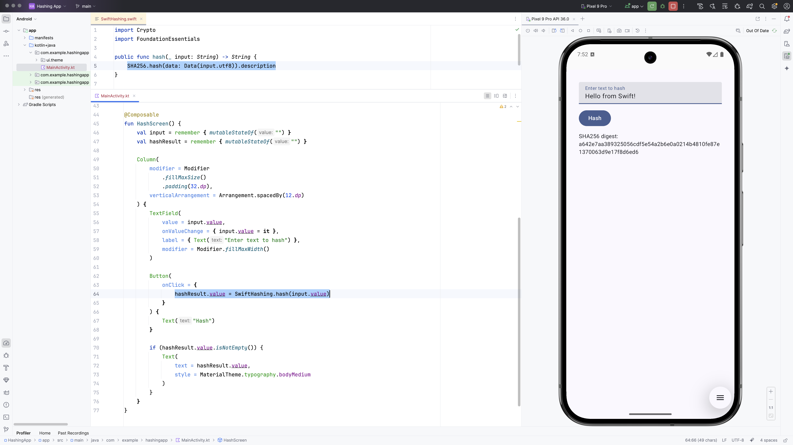

# swift-java on Android

This example contains a sample Android application that demonstrates how to call Swift code from a Android app. 
The example consists of an Android application (`HashingApp`) and a Swift library (`hashing-lib`) that performs a SHA256 hash on a given string.
The Swift library uses [swift-java](https://github.com/swiftlang/swift-java) and the new JNI mode to automatically
generate Java wrappers for calling into the Swift library.



## Overview

The project is structured into two main parts:

1.  **`hashing-lib`**: A Swift package that uses `swift-crypto` to provide a hashing function. It is configured with a Gradle build script (`build.gradle`) that compiles the Swift code into an Android Archive (`.aar`) file. This module utilizes the [swift-java](https://github.com/swiftlang/swift-java) project to create the necessary JNI bindings.

2.  **`HashingApp`**: A standard Android application written in Kotlin using Jetpack Compose. It includes the `.aar` file generated by `hashing-lib` as a local dependency and calls the Swift `hash` function when the user presses a button.

## Prerequisites

Before you can build and run this project, you need to have the following installed:

* **Java Development Kit (JDK)**: We recommend using JDK 21. Ensure the `JAVA_HOME` environment variable is set to your JDK installation path.
* **Swift SDK for Android**: You need to install the [Swift Android SDK](https://github.com/swift-android-sdk/swift-android-sdk/releases)

## Setup and Configuration

### Publish `swift-java` packages locally
As the `swift-java` project does not yet publish the neccessary Java packages needed at runtime, we need to do it ourself, by performing the following steps:

1.  Enter the `hashing-lib` directory
    ```bash
    cd hashing-lib
    ```
2.  Resolve Swift Packages
    ```bash
    swift package resolve
    ```
3. Publish the `swift-java` packages to local Maven repo
    ```bash
    ./.build/checkouts/swift-java/gradlew --project-dir .build/checkouts/swift-java publishToMavenLocal
    ```

## Building and Running the Project

The project must be built in two stages: first the Swift library, then the Android application.

### Step 1: Build the Swift Library (`hashing-lib`)

1.  Navigate to the `hashing-lib` directory:
    ```bash
    cd hashing-lib
    ```

2.  Run the Gradle assemble command. This will compile the Swift code for all supported Android ABIs (arm64-v8a, armeabi-v7a, x86_64), run the `jextract` plugin, and package everything into an `.aar` file.
    ```bash
    ./gradlew assembleRelease
    ```

3.  After a successful build, the Android library will be located at `hashing-lib/build/outputs/aar/hashing-lib-release.aar`.

### Step 2: Build and Run the Android App (`HashingApp`)

1.  Open the `HashingApp` project in Android Studio.

2.  Android Studio will automatically sync the Gradle project. The app is already configured to include the `.aar` file from the `hashing-lib` build output directory.

3.  Run the app on an Android emulator or a physical device.

4.  Enter any text into the text field and press the "Hash" button. The app will call the Swift `hash` function, and the resulting SHA256 digest will be displayed on the screen.