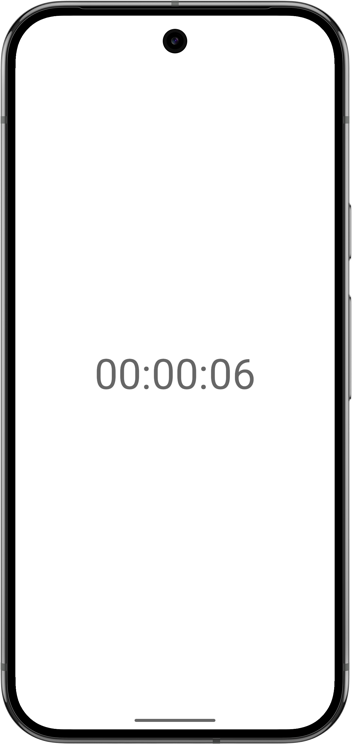

# Swift to Android Callbacks

This example demonstrates bidirectional communication between Swift and Android. The Swift code runs a timer that calls back to Android every second to update the UI with the current time (HH:MM:SS format).



## Overview

The project consists of:

1. **Android App**: A Kotlin activity that starts/stops a timer and displays the current time. It includes a callback method `updateTimer()` that gets called from Swift.
2. **Swift Code**: Implements a background timer using `DispatchQueue` that calls back to the Android activity every second to update the timer display.

## Prerequisites

Before you can build and run this project, you need to have the following installed:

* **Java Development Kit (JDK)**: We recommend using JDK 21. Ensure the `JAVA_HOME` environment variable is set to your JDK installation path.
* **Swiftly**: You need to install [Swiftly](https://www.swift.org/install/)
* **Swift SDK for Android**: You need to install the [Swift Android SDK](https://github.com/swift-android-sdk/swift-android-sdk/releases)

## Running the example

1. Open the `swift-android-examples` project in Android Studio.

2. Select the `hello-swift-callback` Gradle target.

3. Run the app on an Android emulator or a physical device.

## Building from command line

```bash
# Build the sample
./gradlew :hello-swift-callback:assembleDebug

# Install on device/emulator
./gradlew :hello-swift-callback:installDebug
```
