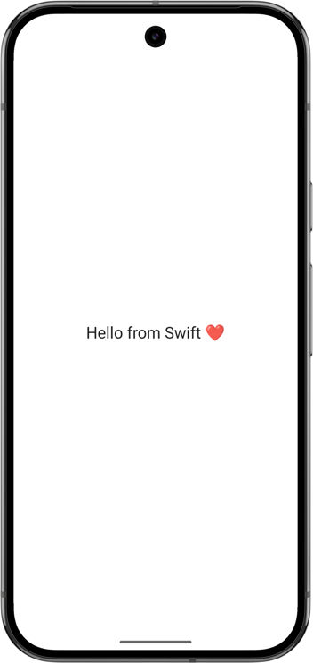

# Basic Swift Integration

This example demonstrates the most basic Swift integration pattern with Android. The app calls a Swift function that returns a "Hello from Swift ❤️" message and displays it in the Android UI.



## Overview

The project consists of:

1. **Android App**: A simple Kotlin activity that declares an external function `stringFromSwift()` and loads the native library.
2. **Swift Code**: Implements the function using `@_cdecl` attribute to match JNI naming convention, returning a greeting message.

## Prerequisites

Before you can build and run this project, you need to have the following installed:

* **Java Development Kit (JDK)**: We recommend using JDK 21. Ensure the `JAVA_HOME` environment variable is set to your JDK installation path.
* **Swiftly**: You need to install [Swiftly](https://www.swift.org/install/)
* **Swift SDK for Android**: You need to install the [Swift SDK for Android](https://swift.org/install)

## Running the example

1. Open the `swift-android-examples` project in Android Studio.

2. Select the `hello-swift` Gradle target.

3. Run the app on an Android emulator or a physical device.

## Building from command line

```bash
# Build the example
./gradlew :hello-swift:assembleDebug

# Install on device/emulator
./gradlew :hello-swift:installDebug
```
