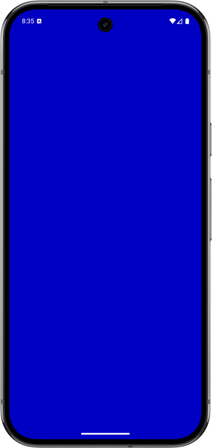

# Full Native Activity

This example demonstrates a complete native Android activity written entirely in Swift. It showcases Android integration including OpenGL ES rendering, native app lifecycle management, and the Android Native App Glue framework.



## Overview

The project consists of:

1. **Native Activity**: A complete Swift implementation that creates an OpenGL ES context and renders a continuously changing colored background.
2. **Android Native App Glue**: Uses the Android Native App Glue framework to handle Android lifecycle and integrates with Choreographer for smooth rendering at 60fps.

## Prerequisites

Before you can build and run this project, you need to have the following installed:

* **Java Development Kit (JDK)**: We recommend using JDK 21. Ensure the `JAVA_HOME` environment variable is set to your JDK installation path.
* **Swiftly**: You need to install [Swiftly](https://www.swift.org/install/)
* **Swift SDK for Android**: You need to install the [Swift Android SDK](https://github.com/swift-android-sdk/swift-android-sdk/releases)
* **Device/emulator with OpenGL ES support**

## Running the example

1. Open the `swift-android-examples` project in Android Studio.

2. Select the `native-activity` Gradle target.

3. Run the app on an Android emulator or a physical device.

## Building from command line

```bash
# Build the sample
./gradlew :native-activity:assembleDebug

# Install on device/emulator
./gradlew :native-activity:installDebug
```
